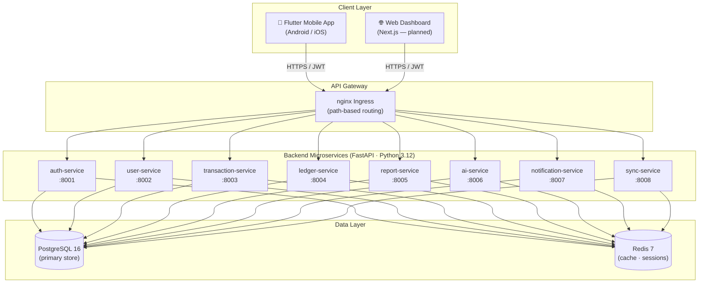
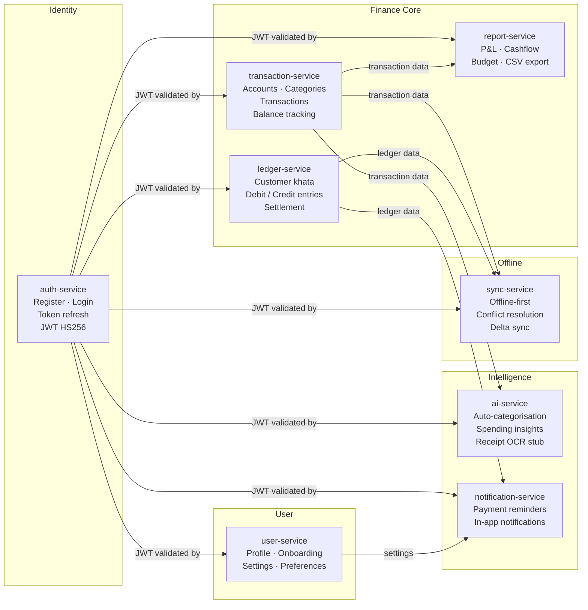
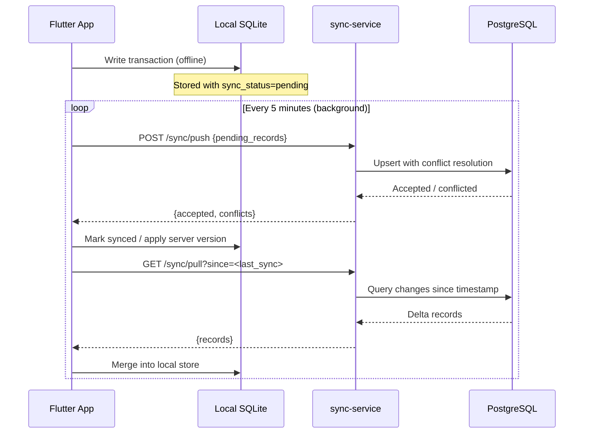
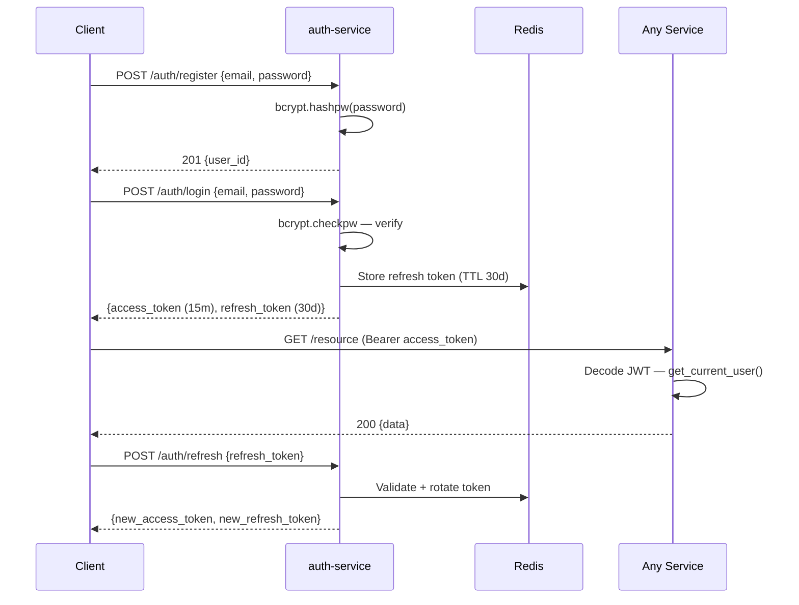
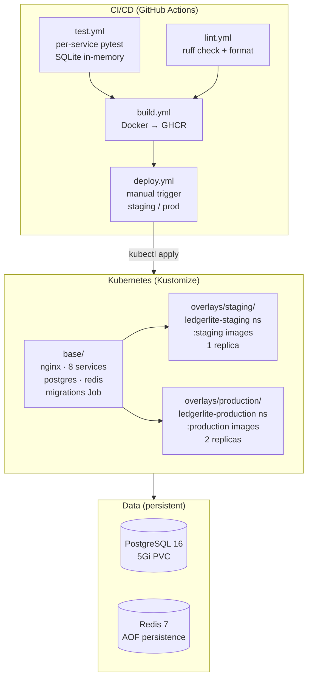
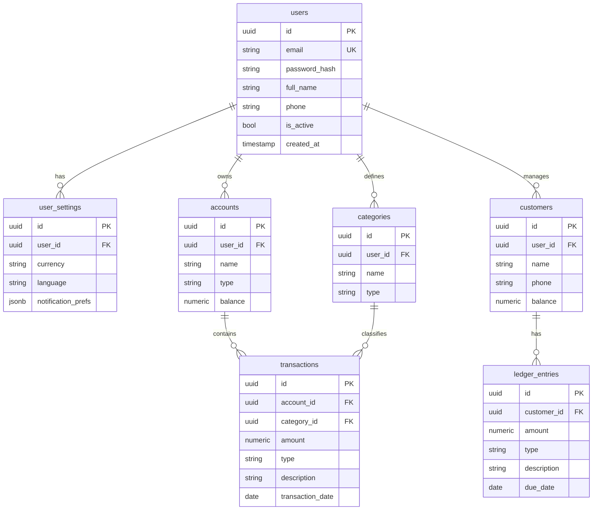

# LedgerLite — Architecture

## 1. System Context



---

## 2. Microservice Responsibilities



---

## 3. Mobile Offline-First Data Flow



---

## 4. Authentication Flow



---

## 5. Infrastructure Layers



---

## 6. Database Schema (Core Tables)



---

## 7. Security & Role-Based Access Control

### Role model

```
user   — default role, all registered users
         can access: own accounts, transactions, ledger, reports, settings, AI, sync
         cannot access: other users' data, /infra page

admin  — elevated role (is_admin=true OR in ADMIN_EMAILS env var)
         can access: everything user can + /infra costs dashboard
         cannot access: other users' financial data (infra admin ≠ data admin)

── planned (Sprint 14+) ──────────────────────────────────────────────────────
org_owner   — created an organisation; full CRUD + invite/remove members
org_member  — invited to an org; scoped access per owner grant
read_only   — accountant / auditor; read-only on org ledger + reports
```

### Defence-in-depth (admin-only features)

```
Layer 1 — UX        Sidebar nav item hidden (adminOnly flag + isAdmin() check)
Layer 2 — Client    useEffect redirect + useQuery enabled:false for non-admins
Layer 3 — Server    Route handler: reads Bearer token → calls auth-service /auth/me
                    → checks is_admin field OR ADMIN_EMAILS server-only env var
                    → returns 401 (no token) / 403 (not admin)
                    → fails CLOSED on network error or timeout
```

Server layer is the **only real security boundary**. Layers 1–2 are UX.

### Env var split (web-dashboard)

| Variable | Prefix | Purpose |
|---|---|---|
| `ADMIN_EMAILS` | (none — server only) | Real access control. Never in browser. |
| `AUTH_URL` | (none — server only) | Internal K8s auth-service URL. |
| `NEXT_PUBLIC_ADMIN_EMAILS` | `NEXT_PUBLIC_` | UI hint for sidebar/page guards. Not a security control. |

### References

- Developer guide: `docs/developer/rbac-guide.md`
- User personas + permission matrix: `docs/product/user-personas.md`
- Admin runbook: `docs/admin/ADMIN-RUNBOOK.md` (local only — see `docs/admin/README.md`)

---

## 8. Monorepo Layout

```
LedgerLite/
├── apps/
│   ├── mobile-app/          # Flutter (Dart) — 43 files, 5-tab nav
│   └── web-dashboard/       # Next.js (planned)
├── services/
│   ├── auth-service/        # :8001
│   ├── user-service/        # :8002
│   ├── transaction-service/ # :8003
│   ├── ledger-service/      # :8004
│   ├── report-service/      # :8005
│   ├── ai-service/          # :8006
│   ├── notification-service/# :8007
│   └── sync-service/        # :8008
├── database/
│   ├── schema.sql           # canonical schema (source of truth)
│   ├── seeds/               # seed data
│   ├── alembic.ini
│   └── migrations/          # Alembic revisions
├── infrastructure/
│   ├── kubernetes/          # Kustomize base + staging + production
│   └── terraform/           # IaC (planned — Sprint 6C)
├── docs/
│   ├── API.md
│   ├── SPRINT-LOG.md
│   ├── ARCHITECTURE.md      # ← this file
│   └── business/            # planning docs, PRDs, investor materials
├── shared/                  # cross-service reference patterns
├── tests/                   # integration / e2e (future)
├── docker-compose.yml
├── Makefile
├── pyproject.toml           # ruff config
├── ROADMAP.md
├── CLAUDE.md
└── README.md
```
